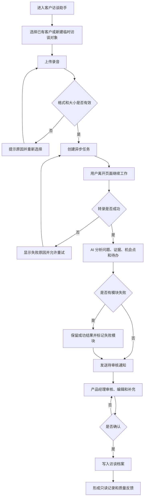
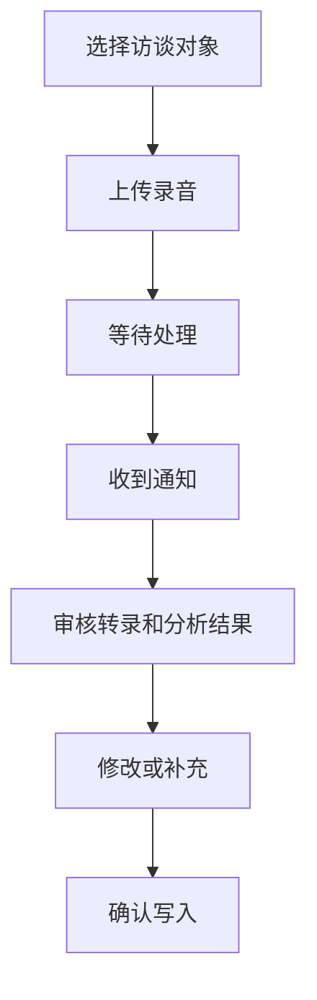

# 客户访谈助手｜产品功能需求文档

## 1. 产品概述

### 1.1 产品定位

客户访谈助手帮助产品经理上传访谈录音，获得可审核的转录、用户问题、需求证据、机会点和待办。AI 只生成初稿；所有正式结论必须由产品经理确认。

### 1.2 目标用户

- 初创公司独立产品经理
- 需要高频整理访谈的产品团队

### 1.3 本期范围

- 上传访谈录音
- 异步转录和分析
- 审核用户问题、证据、机会点和待办
- 确认后写入访谈档案

### 1.4 本期不做

- 自动创建正式需求
- 自动修改路线图
- 自动发送客户消息

## 2. 产品结构与页面关系

```text
客户访谈助手
├─ 访谈任务列表
├─ 上传页
├─ 处理等待页
├─ 审核确认页
└─ 访谈档案页
```

页面关系：任务列表进入上传页；提交后进入等待页；处理完成后从通知或任务列表进入审核页；确认后进入只读档案页。

## 3. 完整产品流程与核心用户流程

### 3.1 完整产品流程



### 3.2 上传与审核流程



## 4. 产品内部运作逻辑


内部规则：

1. 转录失败时，不继续执行后续分析。
2. 某个分析模块失败时，其他成功模块继续保留。
3. 未经用户确认的内容只能保存在待确认区，不得进入正式档案。
4. 确认时记录 AI 初稿、用户最终版本和修改差异。

## 5. 通用组件与交互规则

| 规则 | 产品定义 |
|---|---|
| 编辑 | 双击字段进入编辑；点击外部或按 Enter 保存 |
| 长任务 | 用户可离开页面；任务在后台继续执行 |
| 失败恢复 | 保留用户输入和已成功结果，提供明确重试入口 |
| 危险操作 | 覆盖人工编辑或正式写入前必须二次确认 |
| 已确认记录 | 可查看，不允许普通用户直接修改 |

## 6. 访谈录音上传

### 功能作用

将访谈录音与访谈对象绑定，并创建后台处理任务。

### 页面位置

上传页主体区域，上方为访谈对象选择，下方为文件上传区。

### 进入条件

用户已进入客户访谈助手，并拥有创建访谈任务的权限。

### 操作流程

1. 选择已有客户，或填写临时访谈对象名称。
2. 点击上传区或拖入录音文件。
3. 系统校验格式、大小和文件是否可读取。
4. 校验通过后展示文件名、大小和预计时长。
5. 用户点击“开始处理”。
6. 创建任务后进入等待页，用户可以离开。

### 展示内容与产品规则

- 支持 mp3、wav、m4a。
- 文件不符合要求时，不创建任务。
- 创建任务后锁定本次访谈对象和录音版本。
- 重复点击“开始处理”不得创建重复任务。

### 状态与异常

| 状态 | 页面表现 | 用户操作 |
|---|---|---|
| 默认 | 上传区和格式说明 | 选择文件 |
| 校验中 | 校验提示 | 取消 |
| 校验失败 | 显示具体原因 | 重新选择 |
| 上传中 | 进度条 | 取消 |
| 上传失败 | 保留对象信息并提示重试 | 重试 |
| 任务已创建 | 跳转等待页 | 离开页面 |

### 结果与数据去向

录音进入临时存储，任务进入处理队列；正式访谈档案此时不发生变化。

### 验收标准

1. 非支持格式、空文件和损坏文件会在创建任务前拦截。
2. 上传失败后不清空已选择的访谈对象。
3. 用户重复提交不会创建两个任务。
4. 创建任务后用户离开页面，后台仍继续处理。

## 7. 转录与 AI 分析

### 功能作用

把录音转换为可阅读文本，并生成用户问题、原文证据、机会点和待办初稿。

### 触发条件

录音任务创建成功。

### 内部处理顺序

1. 语音转录。
2. 识别说话人和时间段。
3. 提取用户问题及对应原文证据。
4. 提取需求、机会点和风险。
5. 提取明确约定和建议待办。
6. 保存为待确认草稿。
7. 通知用户审核。

### AI 产品规则

- 没有原文证据的事实不得生成。
- 用户观点与已验证事实必须分开标记。
- AI 可以提出机会点，但不能自动创建正式需求。
- 每个有值结论必须能够定位到原文片段。
- 部分模块失败时保留其他成功结果。

### 状态与异常

| 状态 | 页面表现 | 恢复方式 |
|---|---|---|
| 排队中 | 显示正在排队 | 无需操作 |
| 转录中 | 显示当前阶段 | 可离开页面 |
| 分析中 | 展示分析阶段 | 可离开页面 |
| 待审核 | 显示通知和入口 | 进入审核页 |
| 部分失败 | 标记失败模块，保留成功内容 | 重试失败模块或人工补充 |
| 转录失败 | 显示失败原因 | 重试或重新上传 |

### 验收标准

1. 转录失败时不会生成伪造分析结果。
2. 单个分析模块失败不会清空其他成功结果。
3. 每条 AI 结论都能查看原文证据。
4. 未确认内容不会进入正式访谈档案。

## 8. 审核确认页

### 页面布局

- 左侧：只读转录和原文定位。
- 右侧：用户问题、证据、机会点和待办。
- 底部固定操作栏：暂不确认、确认写入。

### 操作流程

1. 用户阅读转录和 AI 初稿。
2. 点击任意结论查看原文证据。
3. 修改、删除或补充内容。
4. 处理失败模块，或选择人工补充。
5. 点击“确认写入”。
6. 确认后进入只读档案。

### 关键规则

- 删除和修改支持撤销。
- 重新分析会覆盖未确认的人工编辑，必须二次确认。
- “机会点”只作为产品判断材料，不自动成为正式需求。
- 只有确认后内容才写入正式访谈档案。

### 验收标准

1. 用户能清晰区分原文、AI 结论和人工补充。
2. 所有 AI 结论可查看证据。
3. 确认前正式档案无变化。
4. 确认后页面只读，记录 AI 初稿、最终内容和修改差异。

## 9. 跨功能业务规则与异常处理

- 任何正式结论必须经过产品经理确认。
- 转录是后续分析的事实来源；历史资料只能用于消歧，不能补写本次访谈未提及内容。
- 用户重新上传录音时创建新任务，不覆盖已确认档案。
- 网络中断时保留用户已完成的编辑。
- 无权限用户不能查看录音、转录或分析内容。

## 10. 质量监控与成功标准

| 指标 | 定义 | 首期目标 |
|---|---|---|
| 访谈整理时间 | 从打开审核页到确认写入的人工耗时 | 相比手工整理下降 50% |
| 结论采纳率 | AI 初稿未经修改直接确认的结论占比 | 作为观察指标，不设虚假承诺 |
| 无证据事实率 | 抽检中无法找到原文依据的事实占比 | 0% |
| 任务完成率 | 创建任务后成功进入正式档案的比例 | ≥95% |

## 11. 非功能需求

- 支持 Chrome 和 Edge 最新两个大版本。
- 长转录页面滚动应保持流畅。
- 敏感录音、转录和日志必须按权限访问。
- 外部服务失败必须可定位、可重试，并且不丢失已成功结果。

## 12. AI 功能与 Prompt 产品规格

- 输入：本次转录、说话人、时间段和分析字段定义。
- 输出：结构化问题、证据、机会点、风险和待办。
- 人工控制：可编辑、删除、拒绝、补充和重试。
- 致命错误：生成用户未表达的事实，或把 AI 推断写成用户原话。
- 评估方式：使用固定访谈样例进行证据准确率、遗漏率和编造率测试。

## 13. 待确认问题

| 问题 | 当前建议 | 不确认的影响 |
|---|---|---|
| 单个录音最大时长 | 首期限制为 120 分钟 | 影响转录成本与等待时间 |
| 通知渠道 | 首期使用站内通知 | 影响召回体验和开发范围 |
| 已确认档案纠错方式 | 新增纠错记录，不直接覆盖历史 | 影响审计与使用流程 |
