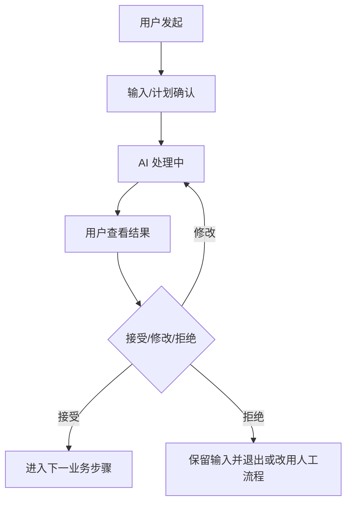
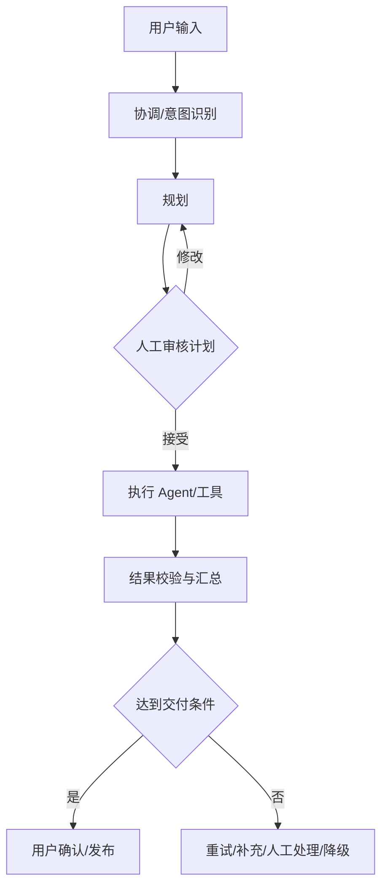

# [AI 功能名称] AI 产品专项规格

- **AI 功能 ID：** AI-001
- **关联落地需求：** [功能/需求 ID]
- **规格深度：** Level A 轻量助手 / Level B 单 Agent / Level C 多 Agent 或高影响
- **状态：** 草稿 / 评审中 / 已确认 / 试点中 / 已上线
- **负责人：**
- **版本：**
- **开发方式：** 你 + Codex / Codex + 技术复核 / 外包工程师

## 1. 用户任务与 AI 必要性
- 用户要完成的任务：
- 当前非 AI 做法：
- AI 增量价值：
- AI 不适用或禁止的范围：
- 出错的主要后果：

## 2. 用户故事

> 作为 [用户角色]，在 [场景] 下，为了 [目标]，需要 [AI 产品支持]。

## 3. AI 功能卡
- AI 角色：生成 / 建议 / 分类 / 抽取 / 评分 / 检索 / 预测 / 执行
- 触发方式：用户主动 / 系统自动 / 条件触发
- 允许决定：
- 禁止决定：
- 人工责任：
- 失败后的替代方式：

## 4. 模型故事（Level B/C 必填）

### MS-001｜[Agent/AI 角色]｜[任务名称]
- 场景描述：
- 目标：

**上下文信息**
- 

**能力支持**
- 

**工具清单**
| 工具 | 用途 | 何时调用 | 参数/权限限制 |
|---|---|---|---|

**输出格式**
- 文本 / JSON Schema / 结构化字段：

**决策规则**
- 继续条件：
- 移交/人工确认条件：
- 拒绝条件：
- 停止条件：

**约束条件**
- 最大轮数/步骤：
- 时间/成本：
- 禁止动作：

**失败与降级**
- 

**测试样例**
- 正常：
- 模糊：
- 异常：

## 5. 用户旅程

## 6. Agent 工作流（Level C 必填）

### Agent 职责表
| Agent | 核心职责 | 输入 | 输出 | 不负责 |
|---|---|---|---|---|

## 7. 输入与上下文
| 输入 | 来源 | 必填 | 新鲜度 | 权限/敏感性 | 缺失/冲突处理 | 是否进入模型 |
|---|---|---|---|---|---|---|

- 来源优先级：
- 上下文组装与压缩：
- 必须保留的信息：
- 提示注入与不可信内容处理：

## 8. 处理边界
| 步骤 | 代码/规则 | 检索/工具 | 模型 | 人工 |
|---|---|---|---|---|

## 9. 输出合同
| 字段 | 类型 | 必填 | 规则 | 来源/证据 | 不确定性表达 | 用户可编辑 |
|---|---|---|---|---|---|---|

- 自然语言风格：
- 禁止内容：
- 引用/依据展示：
- 代码层结构校验：

## 10. 人机责任与确认节点
| 动作/决定 | AI | 用户 | 审核者/运营 | 必须确认 | 不响应时 | 可撤销 |
|---|---|---|---|---|---|---|

## 11. Prompt 设计策略
- Prompt 目标：
- 核心挑战：
- 设计策略：角色 / Few-shot / 工具绑定 / 结构化输出 / 分步规划 / 反例
- 输出控制：
- 必须由代码保证的规则：
- 示例说明：
- Prompt 文件/版本：
- 修改后的回归范围：

## 12. 状态与交互
| 状态 | 用户看到 | 可执行操作 | 系统行为 | 重试/恢复 | 数据保留 |
|---|---|---|---|---|---|

至少检查：等待输入、校验、处理中、部分完成、需补充、需人工复核、失败、超时、被拒绝、成功、已撤销。

## 13. 标准测试样例集

### 13.1 规模
- 原型：10-20 条；
- 内部可用：20-50 条；
- 客户试点：50-100+ 条；
- 高风险正式上线：根据风险和专家标注扩大。

### 13.2 样例结构
| ID | 输入/上下文 | 必须包含 | 禁止出现 | 预期流程/工具 | 允许变体 | 严重性 |
|---|---|---|---|---|---|---|

### 13.3 数据切片
| 切片 | 样本来源 | 数量 | 风险 | 标注方式 |
|---|---|---:|---|---|
| 正常 | | | | |
| 模糊/缺失 | | | | |
| 困难/长尾 | | | | |
| 敏感/对抗 | | | | |
| 工具失败 | | | | |
| 真实 bad case | | | | |

## 14. 测试与上线阈值

### 14.1 确定性测试
| 测试 | 方法 | 目标 | 阻断条件 |
|---|---|---|---|
| Schema/格式 | | | |
| 工具/权限 | | | |
| 状态/步骤上限 | | | |
| 失败恢复 | | | |

### 14.2 概率性评估
| 指标 | 评估方式 | 样本 | 目标 | 阻断阈值 | 人工/自动 |
|---|---|---:|---|---|---|
| 准确性/相关性 | | | | | |
| 完整性 | | | | | |
| 无依据陈述/幻觉 | | | | | |
| 可执行性/有用性 | | | | | |
| 评分一致性 | | | | | |

> 测试标准是预期目标，不要写成已经达到的线上成绩。

## 15. 错误分类
| 错误类型 | 示例 | 严重性 | 用户影响 | 处理/降级 | 是否阻断试点/上线 |
|---|---|---|---|---|---|

## 16. 失败、重试与降级
| 失败点 | 检测方式 | 最大重试 | 用户提示 | 系统处理 | 替代方案 | 升级/告警 |
|---|---|---:|---|---|---|---|

## 17. 延迟、成本与容量
| 场景 | 首次反馈 | P50/P95 | 单次成本 | 并发/配额 | 超限处理 |
|---|---|---|---|---|---|

## 18. Agent 工具与行动控制（如适用）
| 工具/动作 | 读/写/不可逆 | 参数限制 | 人工批准 | 幂等/撤销 | 日志 |
|---|---|---|---|---|---|

- 最大步骤/时间/成本：
- 停止条件：
- 沙箱/预演：
- 事故与补偿：
- 回滚方式：

## 19. 数据、安全与审计
- 数据使用和保留：
- 第三方服务：
- 权限和租户隔离：
- 模型/Prompt/知识库/工具版本：
- 复现与审计字段：
- 敏感领域限制：

## 20. 线上监控与持续改进
- 成功率/异常中断率：
- 用户放弃/拒绝/重试：
- 人工修改率/采纳率：
- P0/P1 错误：
- 延迟和成本：
- bad case 回流：
- 版本升级、灰度和回退：

## 21. 版本规划
| 版本 | 验证目标 | 包含 | 不包含 | 升级条件 |
|---|---|---|---|---|

## 22. 验收场景
1. Given ... When ... Then ...
2. Given [无来源/低证据] When ... Then [补充/拒答/人工复核]。
3. Given [模型或工具失败] When ... Then [降级且不丢失用户输入]。
4. Given [高风险动作] When ... Then [必须人工批准且可审计]。

## 23. 待确认
| ID | 问题 | 影响 | 负责人 | 阻塞节点 | 临时假设 | 最晚确认时间 |
|---|---|---|---|---|---|---|
