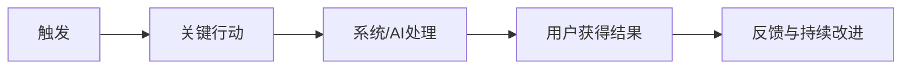

# [产品/项目名称] 概念需求文档

- **状态：** 草稿 / 评审中 / 已确认 / 已废弃
- **版本：** [版本]
- **负责人：** [负责人]
- **确认人：** [确认人]
- **创建日期：** [日期]
- **更新日期：** [日期]
- **来源材料：** [研究、会议、现有产品、数据等]
- **本版变更：** [变更摘要]

> 本文档用于确认产品方向、核心机制与范围。只有“确认记录”为已确认后，才能进入落地需求文档。

## 1. 产品背景与决策目标
- 当前背景：
- 为什么现在需要做：
- 本文档要确认的核心决策：

## 2. 目标用户与问题
### 2.1 角色
| 角色 | 所处情境 | 目标 | 当前做法 | 主要问题 | 影响 |
|---|---|---|---|---|---|

### 2.2 核心问题
- 问题陈述：
- 证据：
- 反向证据或不确定性：
- 不解决的后果：

## 3. 产品主张
- 一句话概念：
- 产品如何改变现状：
- 核心价值机制：
- 战略价值与差异化：

## 4. 方案比较
| 维度 | 方案 A | 方案 B | 方案 C |
|---|---|---|---|
| 核心机制 | | | |
| 用户价值 | | | |
| 使用门槛 | | | |
| 实现与数据依赖 | | | |
| 运营负担 | | | |
| 风险与失败方式 | | | |
| 学习速度 | | | |
| 可逆性 | | | |

- **推荐方案：**
- **推荐理由：**
- **拒绝/延后其他方案的原因：**

## 5. 已选产品概念
### 5.1 核心用户闭环

### 5.2 关键用户旅程
1. [角色 / 场景 / 行动 / 结果]
2. [角色 / 场景 / 行动 / 结果]

### 5.3 系统边界与责任
- 产品负责：
- 用户负责：
- 运营/管理员负责：
- AI负责（如适用）：
- 必须由人确认（如适用）：
- 明确不负责：

## 6. 当前范围
### 6.1 本期/MVP
- [ ]

### 6.2 后续扩展
- [ ]

### 6.3 明确不做
- [ ]

### 6.4 依赖与约束
- [ ]

## 7. 成功、失败与学习
| 类型 | 定义 | 衡量方式 | 当前水平 | 目标/判断阈值 |
|---|---|---|---|---|
| 用户结果 | | | | |
| 业务结果 | | | | |
| 质量/信任 | | | | |
| 反向指标 | | | | |

- 最危险假设：
- 本期最重要的学习问题：
- 扩大条件：
- 调整条件：
- 停止条件：

## 8. 风险与待确认
| ID | 问题/风险 | 影响 | 负责人 | 阻塞节点 | 当前临时假设 |
|---|---|---|---|---|---|

## 9. 确认记录
- **决策：** 已确认 / 需修改 / 暂缓 / 否决
- **确认人：**
- **确认日期：**
- **确认范围：**
- **附带条件：**
- **允许进入的下一阶段：** 落地需求文档 / 原型验证 / 补充调研 / 其他
