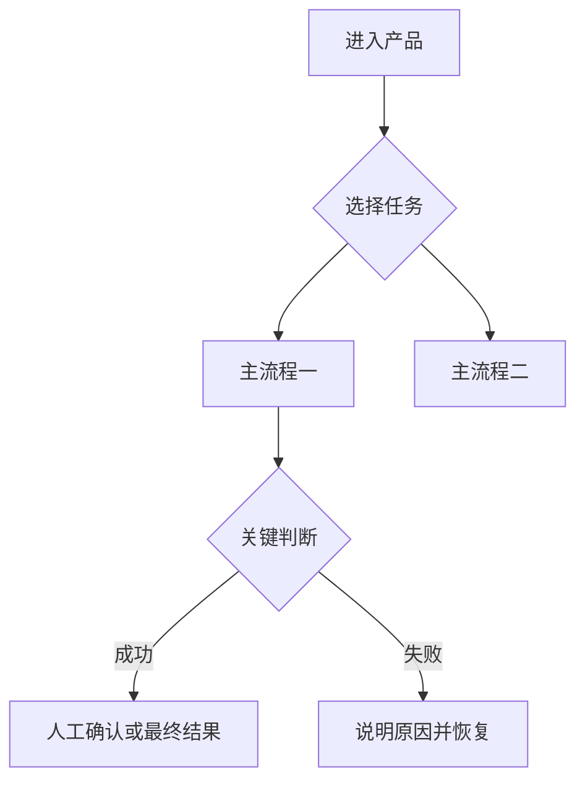

# [产品名称] 产品功能需求文档

| 项目 | 内容 |
|---|---|
| 文档状态 | 待评审 / 已确认 / 开发中 / 已验收 |
| 产品负责人 | [负责人] |
| 更新日期 | [日期] |
| 适用端 | [PC Web / 移动端 / 多端] |
| 文档用途 | 界定当前产品功能、交互、内部运作逻辑与产品验收标准 |

> 文档原则：只描述当前产品；保留全部已确认设计；不写版本修订过程；不把工程实现细节混入正文。

## 1. 产品概述

### 1.1 产品定位

### 1.2 目标用户与使用时机

### 1.3 产品范围

### 1.4 本期明确不做

### 1.5 核心产品原则 / AI 行为红线

### 1.6 质量目标与错误容忍度

## 2. 产品结构与页面关系

### 2.1 功能结构

```text
[产品]
├─ [业务模块一]
├─ [业务模块二]
└─ [通用能力]
```

### 2.2 页面清单与职责

| 页面 | 主要职责 | 关键结果 |
|---|---|---|

### 2.3 页面关系

[页面关系图]

## 3. 完整产品流程与核心用户流程

### 3.1 完整产品流程



### 3.2 [核心任务一]

[用户可见流程图]

### 3.3 [核心任务二]

[用户可见流程图]

## 4. 产品内部运作逻辑

### 4.1 [内部链路一]

[任务登记 → 处理 → 待确认 → 正式结果 → 质量回流]

### 4.2 [内部链路二]

### 4.3 关键状态

### 4.4 结果与数据去向

## 5. 通用组件与交互规则

### 5.1 [通用组件]

- 功能作用：
- 数据来源：
- 展示规则：
- 触发方式：
- 关键状态与异常：

### 5.2 全局编辑、返回与加载规则

## 6. [业务模块一]

### 6.1 页面布局

### 6.2 整体操作流程

### 6.3 [核心功能]

**功能作用**

**页面位置与进入条件**

**完整操作过程**

**展示内容与产品规则**

**交互反馈**

**关键状态、异常与恢复**

**结果与数据去向**

**验收标准**

## 7. [业务模块二]

[按相同原则展开，但不机械压缩或重复无关字段。]

## 8. 跨功能业务规则与异常处理

### 8.1 信息来源与冲突规则

### 8.2 重新生成、覆盖与确认规则

### 8.3 外部服务和模块失败

### 8.4 关键用户文案

## 9. 质量监控与成功标准

### 9.1 质量目标

### 9.2 抽检与反馈

### 9.3 使用率、采纳率与投诉率

## 10. 非功能需求

### 10.1 性能

### 10.2 可用性

### 10.3 隐私与数据

### 10.4 兼容性

## 11. AI 功能与 Prompt 产品规格（如适用）

只写输入来源、输出、核心约束、人工控制和质量目标。完整 Prompt、Schema 和评估进入 AI 功能规格。

## 12. 待确认问题

| 问题 | 当前状态 | 影响 |
|---|---|---|
