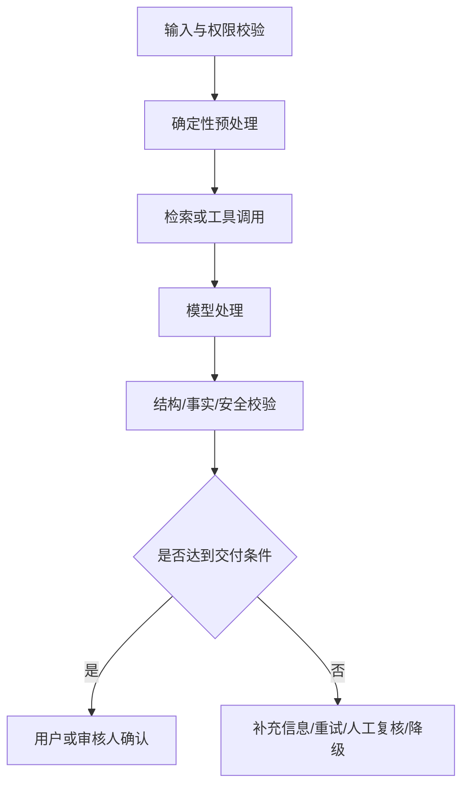

# AI 产品专项规格标准

本参考用于把“模型能力”转成可设计、可开发、可评估、可运营的产品要求。它作为落地 PRD 的伴随文档，不强行塞进主 PRD 第 9 节。

核心原则：AI 产品不仅要写用户怎么操作，还要写 AI/Agent 如何工作、需要什么上下文、能调用什么工具、输出如何约束、何时让人确认、失败如何处理、怎样证明质量达标。

## 1. 先选择规格深度

### Level A：轻量 AI 助手
适用：改写、总结、低风险抽取、文案建议等。

最小要求：
- AI 功能卡；
- 输入/输出；
- 用户可编辑；
- 失败提示；
- 10-20 个真实测试样例。

### Level B：单 Agent 工作流
适用：需要检索、工具调用、结构化输出、评分或多步处理。

增加：
- 模型故事；
- 处理流程；
- 工具和权限；
- 人工确认；
- 20-50 个标准测试样例；
- 延迟、成本、失败和监控。

### Level C：多 Agent 或高影响 AI
适用：多个 Agent 协作、自动执行外部动作、影响正式成绩/人员判断/客户数据、复杂企业流程。

增加：
- Agent 工作流；
- 每个 Agent 的模型故事；
- Agent 间输入输出；
- 人工决策节点；
- Prompt 策略与版本；
- 评估数据集；
- 概率性测试；
- 权限、安全、审计、回滚和事故处理。

初创公司不需要一开始准备上千条样本，但不能完全没有标准样例。先用少量真实高价值案例建立判断能力，再随着试点积累 bad case。

## 2. AI 功能是否值得做

先回答：
- 用户真正要完成什么任务；
- 当前非 AI 做法是什么；
- 为什么规则、表单、搜索、模板或人工流程不足；
- AI 带来的增量价值；
- 出错代价；
- 能否提供足够的上下文、数据和人工复核；
- 是否适合先做 AI 辅助而不是 AI 自动决定。

能用确定性逻辑可靠解决的部分，优先用确定性逻辑。

## 3. AI 功能卡

每个 AI 功能单独定义：

- **AI 功能 ID：** `AI-001`
- **用户任务：**
- **触发方式：** 用户主动 / 系统自动 / 条件触发
- **为何需要 AI：**
- **AI 角色：** 生成 / 建议 / 分类 / 抽取 / 评分 / 检索 / 预测 / 执行
- **允许决定：**
- **禁止决定：**
- **人工责任：**
- **输入合同：**
- **输出合同：**
- **质量目标：**
- **失败后果：**
- **替代方案：**
- **审计要求：**

## 4. 用户故事与模型故事要分开

### 用户故事
描述人为什么使用功能：

> 作为 [用户角色]，在 [场景] 下，为了 [目标]，需要 [产品支持]。

### 模型故事
描述 AI/Agent 为完成任务需要什么：

> 作为 [Agent/AI 角色]，在 [任务场景] 下，为了 [完成目标]，我需要以下上下文、工具、能力和约束。

每个重要 Agent 的模型故事至少包含：

1. **场景描述**；
2. **目标**；
3. **上下文信息**：用户输入、历史记录、系统状态、资料、当前时间等；
4. **能力支持**：分类、规划、抽取、推理、生成、验证等；
5. **工具清单**：用途、何时调用、参数边界；
6. **输出格式**：文本、JSON Schema、枚举、字段约束；
7. **决策规则**：什么时候继续、移交、拒绝、重试或停止；
8. **约束条件**：轮数、步骤、时间、成本、安全、禁止动作；
9. **失败与降级**；
10. **人工确认点**；
11. **测试样例**。

模型故事写“需要什么”，工程规格再写“如何实现”。

## 5. 用户旅程与 Agent 工作流要分开

### 用户旅程
描述用户看到、操作、等待、确认和获得结果的过程。

### Agent 工作流
描述系统内部的 AI/Agent、工具、代码和人工节点如何协作。

多 Agent 产品必须提供 Mermaid 工作流，至少标注：
- 用户输入；
- 意图识别/澄清；
- 规划；
- 人工审核；
- Agent 分工；
- 工具调用；
- 结果汇总；
- 编辑/重试；
- 失败和退出。

同时定义每个 Agent 的输入和输出，防止 Agent 之间只靠自然语言猜测。

## 6. 输入与上下文

定义：
- 用户输入；
- 系统数据；
- 历史对话和状态；
- 企业知识库；
- 外部来源；
- 工具结果；
- 来源优先级、更新时间、可信度和冲突处理；
- 必填、可选、缺失、过长和格式错误；
- 敏感数据、租户隔离和使用许可；
- 上下文压缩时必须保留什么；
- 哪些输入不能发送给第三方模型。

如果输出依赖事实，必须定义来源追踪，而不是只写“禁止幻觉”。

## 7. 处理流程与确定性边界

明确区分：
- 代码/规则完成的步骤；
- 检索/工具完成的步骤；
- 模型完成的步骤；
- 人工完成的步骤。

推荐流程：

不要让模型负责 ID、权限、计数、精确计算、幂等和确定性校验。

## 8. 输出合同

定义：
- 结构化输出 Schema；
- 字段、类型、枚举、长度、必填和校验；
- 自然语言风格和禁止内容；
- 引用/证据展示；
- 不确定性表达；
- 用户能否编辑、重试、补充、拒绝、撤销和恢复；
- 流式输出、部分结果和超时；
- 结果版本和差异；
- AI 身份与能力边界。

结构化输出必须由代码再次校验，不能只依赖 Prompt。

## 9. 人工确认节点

对每个节点写清：
- 人为什么需要确认；
- 人看到什么信息；
- 可以接受、修改还是拒绝；
- 不响应时怎么处理；
- 是否允许自动接受；
- 自动接受适用于什么低风险场景；
- 决策如何记录。

高风险产品不得因用户超时自动通过关键审核。

## 10. Prompt 设计要求

AI PRD 不需要把完整 Prompt 当作最终产品规则，但应说明：
- Prompt 要解决什么问题；
- 采用什么策略：角色、Few-shot、结构化输出、工具绑定、分步规划、反例等；
- 如何控制输出；
- 哪些规则必须由代码保证；
- 使用哪些示例说明设计意图；
- Prompt 文件位置、版本和负责人；
- 修改 Prompt 后需要跑哪些回归测试。

提示词是实现资产，不是替代产品规格。

## 11. 质量评估数据集

### 11.1 标准测试样例集（Golden Set）

每条样例包括：
- 输入；
- 必要上下文；
- 允许的合理输出范围；
- 必须包含；
- 禁止出现；
- 预期工具/流程；
- 人工确认点；
- 错误严重性。

### 11.2 初创阶段建议规模

| 阶段 | 建议样例 | 目标 |
|---|---:|---|
| 原型 | 10-20 | 发现明显方向错误 |
| 内部可用 | 20-50 | 覆盖常见、困难和失败场景 |
| 客户试点 | 50-100+ | 评估稳定性、长尾和客户差异 |
| 高风险正式上线 | 按风险扩大，并由专家标注 | 建立可审计的上线门槛 |

不要复制示例文档中的样本量作为硬要求。样本量应根据风险、任务复杂度和可获得数据决定。

### 11.3 数据切片

至少考虑：
- 正常案例；
- 模糊输入；
- 缺失输入；
- 长文本；
- 冲突来源；
- 长尾和边界；
- 敏感/对抗输入；
- 工具失败；
- 多语言（如需要）；
- 真实 bad case。

验收集与调试样例应隔离，避免“记答案”。

## 12. 测试标准：确定性 + 概率性

### 确定性测试
适合：
- Schema 是否有效；
- 字段是否完整；
- 工具是否被调用；
- 权限和步骤上限；
- 状态流转；
- 格式、引用和日志；
- 超时、重试和回退。

### 概率性评估
适合：
- 相关性；
- 完整性；
- 准确性；
- 可执行性；
- 可读性；
- 风格符合度；
- 幻觉/无依据陈述；
- 评分一致性；
- 用户有用性。

每项写清：
- 测试方法；
- 样本；
- 目标值；
- 上线阻断值；
- 人工还是自动评估；
- 达不到时如何处理。

测试标准是目标，不得写成已经实现的成绩。

## 13. AI 错误分类

至少区分：
- 无依据或虚构；
- 关键遗漏；
- 错误分类、评分或推荐；
- 格式/Schema 失败；
- 工具调用错误；
- 敏感信息泄露；
- 越权或不当行动；
- 有害、偏见或不合规内容；
- 过度拒答；
- 延迟、超时或服务失败。

定义 P0/P1/P2 错误和试点/上线阻断阈值。

## 14. 异常、重试与降级

每个关键失败点定义：
- 如何检测；
- 是否自动重试；
- 最大重试次数；
- 是否切换备用模型/工具；
- 是否返回部分结果；
- 是否跳过非关键步骤；
- 用户看到什么；
- 是否保留输入和进度；
- 何时要求人工处理；
- 何时终止。

高风险节点失败时，默认停止或人工处理；低风险非关键步骤可记录并继续。

## 15. 性能、成本与容量

至少定义：
- 首次反馈时间；
- 端到端 P50/P95；
- 单步骤耗时；
- 单次 Token/API 成本；
- 并发和配额；
- 超限策略；
- 用户等待体验；
- 是否允许后台执行和通知。

对初创产品优先明确“试点能承受的成本”，不必一开始追求大规模架构。

## 16. Agent 工具与行动控制

当 AI 能调用工具或改变外部状态时，额外定义：
- 工具用途和参数范围；
- 读、可逆写、不可逆写分级；
- 必须人工批准的动作；
- 最大步骤、时间、成本和循环次数；
- 停止条件；
- 幂等和重复调用；
- 沙箱、预演和确认摘要；
- 日志和工具输入输出；
- 撤销、补偿和事故处理；
- Prompt 注入和恶意外部内容防护。

## 17. 数据、安全与治理

定义：
- 数据是否用于日志、评估、训练或微调；
- 数据最小化、脱敏、保留和删除；
- 租户隔离；
- 第三方服务的数据条款；
- 内容安全和敏感领域限制；
- 模型、Prompt、知识库、工具和策略版本；
- 复现结果所需记录；
- 访问、修改、发布和覆盖权限。

## 18. 线上监控与持续改进

监控：
- 完成率和异常中断率；
- 用户放弃/拒绝/重试；
- 工具失败；
- 输出格式失败；
- 人工修改率；
- 采纳率和有用性；
- P0/P1 错误；
- 延迟和成本；
- 不同版本质量变化。

把线上 bad case 按规则进入测试样例集。模型、Prompt、知识库或工具升级前跑回归，支持灰度和回退。

## 19. 版本规划

AI 产品路线图应按要验证的能力递进，而不是按“Agent 越多越高级”。

示例：
- MVP：单条核心工作流 + 人工审核；
- 下一版：增加澄清、失败恢复和真实数据；
- 再下一版：增加工具/知识库和运营能力；
- 规模化：多租户、安全、监控、成本和高级自动化。

每版写清包含、不包含、验证目标和升级条件。

## 20. AI 培训内容生成专项

当 AI 把材料转成课程、关卡、测试、作业或能力证据时，评估两层质量。

### 组装质量
- 文件解析、去重、分类、分组和来源关联；
- 结构化输出稳定；
- 低置信度可恢复；
- 不串项目/租户数据。

### 培训质量
- 目标覆盖；
- 概念、规则、步骤、例外、案例和标准是否充分；
- 测试/作业是否完整；
- 是否映射真实岗位行为；
- 高影响规则是否可追溯且经人工确认；
- 是否先教后练；
- 测评案例是否与示范有实质差异；
- 管理员修改量和发布成本是否可接受。

标准样例集应包含：源材料、期望分组、必需目标、禁止推断、可接受变体、测评答案和专家决定。

## 21. AI 过程透明与用户信任

AI 需要较长时间或多步骤执行时，产品规格还应定义：
- 当前在做什么；
- 已完成多少；
- 是否正在等待用户、工具或人工；
- 用户能否取消、后台运行或稍后回来；
- 部分结果是否可见；
- 失败发生在哪一步；
- 重试是否会重复收费或重复写入；
- 哪些内部推理不应展示，但哪些来源、动作和状态必须可见。

透明不等于展示模型私有思维过程。应展示可验证的计划、工具动作、来源、进度、错误和人工决定。
